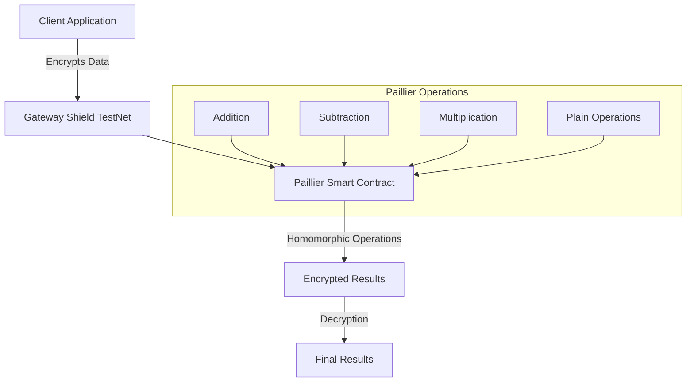

Paillier Homomorphic Encryption is a probabilistic asymmetric algorithm for public key cryptography that enables specific types of mathematical operations to be performed on encrypted values. Gateway Protocol implements Paillier encryption through a smart contract deployed on the Shield testnet L2, allowing for secure, privacy-preserving computations directly on-chain.

## Key Features

### Core Components

1. **Cryptographic Structures**

   ```solidity
   struct Ciphertext {
       bytes value;
   }

   struct PublicKey {
       bytes n;
       bytes g;
   }

   struct PrivateKey {
       bytes lambda;
       bytes mu;
   }
   ```

### Supported Operations

1. **Basic Arithmetic Operations**

   - Addition of two encrypted values (`add`)
   - Subtraction of two encrypted values (`sub`)
   - Addition of plaintext to encrypted value (`add_const`)
   - Subtraction of plaintext from encrypted value (`sub_const`)
   - Multiplication of encrypted value by plaintext (`mul_const`)
   - Division of encrypted value by plaintext (`div_const`)

2. **Cryptographic Operations**
   - Encryption of zero with randomness (`encryptZero`)
   - Value encryption with randomness (`encrypt`)
   - Secure decryption with sigma verification (`decrypt`)

## Security Properties

1. **Semantic Security**

   - Probabilistic encryption using random values
   - Different ciphertexts for same plaintext across encryptions
   - Protection against chosen-plaintext attacks

2. **Homomorphic Properties**

   ```
   E(m₁) · E(m₂) mod n² = E(m₁ + m₂ mod n)
   E(m)ᵏ mod n² = E(km mod n)
   ```

3. **Zero-Knowledge Properties**
   - Computations on encrypted values
   - No information leakage during operations
   - Sigma verification for secure decryption

## Architecture Overview



## Current Limitations

### Limited Homomorphic Operations

The Paillier cryptosystem is fundamentally restricted to additive homomorphic operations. While it excels at operations like summing encrypted values or multiplying them by constants, it cannot perform, for example, multiplication between two encrypted values.

Developers must carefully design their applications around these constraints, as they are not possible out of the box.

### Performance Constraints

Performance remains a significant challenge in the Paillier cryptosystem implementation. The encryption process produces ciphertexts that are substantially larger than their corresponding plaintexts, leading to increased storage requirements and higher gas costs for on-chain operations.

Key generation and encryption/decryption processes demand considerable computational resources, which can impact application responsiveness and scalability.

### Restricted Features

The system's inability to perform direct comparisons between encrypted values or execute boolean operations on encrypted data presents substantial practical limitations. Applications requiring complex business logic or conditional operations must implement workarounds or rely on additional cryptographic protocols.

## Comparison with Alternative Technologies

<Warning>The Paillier cryptosystem implementation is meant to be deprecated in the future in favor of the Gateway Virtual Machine, a fully optimized, EVM-compatible layer 1 powered by garbled circuits.</Warning>

| Feature | Paillier Encryption | Fully Homomorphic Encryption | Garbled Circuits |
|---------|--------------------|-----------------------------|------------------|
| **Supported Operations** | Addition and constant multiplication | All mathematical operations | Any computable function |
| **Performance** | Moderate computation overhead | High computation overhead | Efficient for boolean and arithmetic operations |
| **Ciphertext Size** | 2x plaintext size | 10-100x plaintext size | Circuit-dependent |
| **Gas Costs** | Moderate | Very high | Operation-dependent |
| **Use Case Fit** | Simple aggregations, voting | Complex computational workflows | Boolean logic, comparisons |
| **Implementation Complexity** | Moderate | High | Moderate |
| **Security Level** | Semantically secure | Fully secure | Secure in malicious model |
| **On-chain Viability** | Practical | Currently impractical | Practical for specific operations |
| **Development Maturity** | Well-established | Emerging | Production-ready |

## Getting Started

1. **Contract Interaction**

   ```javascript
   const PaillierContract = await ethers.getContractFactory("Paillier");
   const paillier = await PaillierContract.attach(DEPLOYED_ADDRESS);
   ```

2. **Key Generation (Off-chain)**

   ```javascript
   const { publicKey, privateKey } = await generatePaillierKeys();
   ```

3. **Basic Operations**

   ```javascript
   // Encrypt values
   const encryptedValue = await paillier.encrypt(value, randomness, publicKey);

   // Perform operations
   const sum = await paillier.add(encryptedValue1, encryptedValue2, publicKey);

   // Decrypt result
   const result = await paillier.decrypt(
     encryptedValue,
     publicKey,
     privateKey,
     sigma
   );
   ```

## Next Steps

- [Smart Contract Documentation](./paillier-contract)
- [Integration Guide](./paillier-integration)
- [Example Implementations](./paillier-examples)
