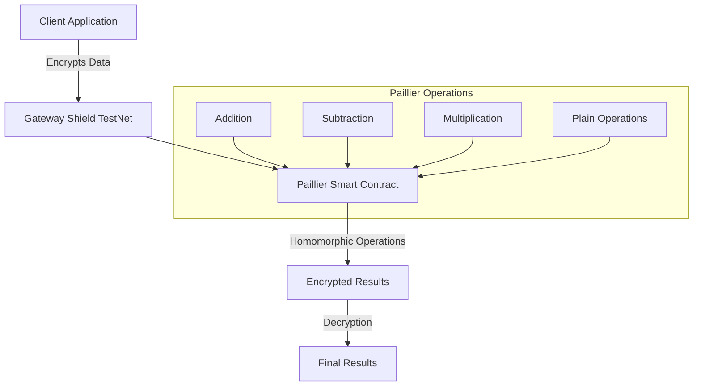

Paillier Homomorphic Encryption is a probabilistic asymmetric algorithm for public key cryptography that enables specific types of mathematical operations to be performed on encrypted values. Gateway Protocol implements Paillier encryption through a smart contract deployed on the Shield testnet L2, allowing for secure, privacy-preserving computations directly on-chain.

## Key Features

### Core Components

1. **Cryptographic Structures**

   ```solidity
   struct Ciphertext {
       bytes value;
   }

   struct PublicKey {
       bytes n;
       bytes g;
   }

   struct PrivateKey {
       bytes lambda;
       bytes mu;
   }
   ```

### Supported Operations

1. **Basic Arithmetic Operations**

   - Addition of two encrypted values (`add`)
   - Subtraction of two encrypted values (`sub`)
   - Addition of plaintext to encrypted value (`add_const`)
   - Subtraction of plaintext from encrypted value (`sub_const`)
   - Multiplication of encrypted value by plaintext (`mul_const`)
   - Division of encrypted value by plaintext (`div_const`)

2. **Cryptographic Operations**
   - Encryption of zero with randomness (`encryptZero`)
   - Value encryption with randomness (`encrypt`)
   - Secure decryption with sigma verification (`decrypt`)

## Security Properties

1. **Semantic Security**

   - Probabilistic encryption using random values
   - Different ciphertexts for same plaintext across encryptions
   - Protection against chosen-plaintext attacks

2. **Homomorphic Properties**

   ```
   E(m₁) · E(m₂) mod n² = E(m₁ + m₂ mod n)
   E(m)ᵏ mod n² = E(km mod n)
   ```

3. **Zero-Knowledge Properties**
   - Computations on encrypted values
   - No information leakage during operations
   - Sigma verification for secure decryption

## Architecture Overview



## Use Cases

1. **Private Financial Operations**

   - Account balance updates
   - Private token transfers
   - Confidential payment processing

2. **Secure Aggregation**

   - Vote tallying
   - Survey results
   - Anonymous analytics

3. **Privacy-Preserving Calculations**
   - Salary computations
   - Tax calculations
   - Price discovery

## Security Considerations

1. **Key Management**

   - Secure storage of private keys
   - Safe public key distribution
   - Proper random value generation

2. **Operation Security**

   - Sigma verification for decryption
   - Modular arithmetic overflow prevention
   - Proper parameter validation

3. **Gas Optimization**
   - Efficient operation batching
   - Optimized parameter sizes
   - Smart contract gas limits

## Getting Started

1. **Contract Interaction**

   ```javascript
   const PaillierContract = await ethers.getContractFactory("Paillier");
   const paillier = await PaillierContract.attach(DEPLOYED_ADDRESS);
   ```

2. **Key Generation (Off-chain)**

   ```javascript
   const { publicKey, privateKey } = await generatePaillierKeys();
   ```

3. **Basic Operations**

   ```javascript
   // Encrypt values
   const encryptedValue = await paillier.encrypt(value, randomness, publicKey);

   // Perform operations
   const sum = await paillier.add(encryptedValue1, encryptedValue2, publicKey);

   // Decrypt result
   const result = await paillier.decrypt(
     encryptedValue,
     publicKey,
     privateKey,
     sigma
   );
   ```

## Next Steps

- [Smart Contract Documentation](./paillier-contract)
- [Integration Guide](./paillier-integration)
- [Example Implementations](./paillier-examples)
