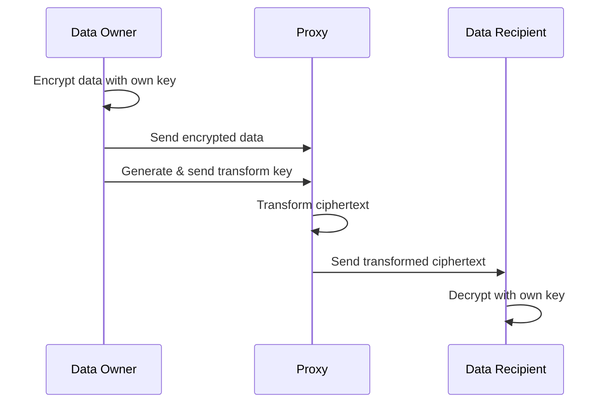
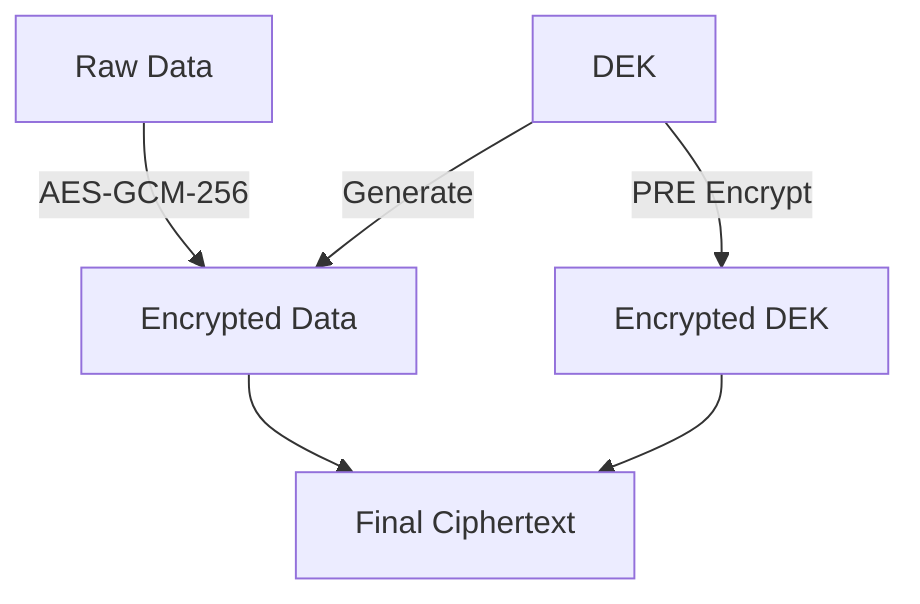
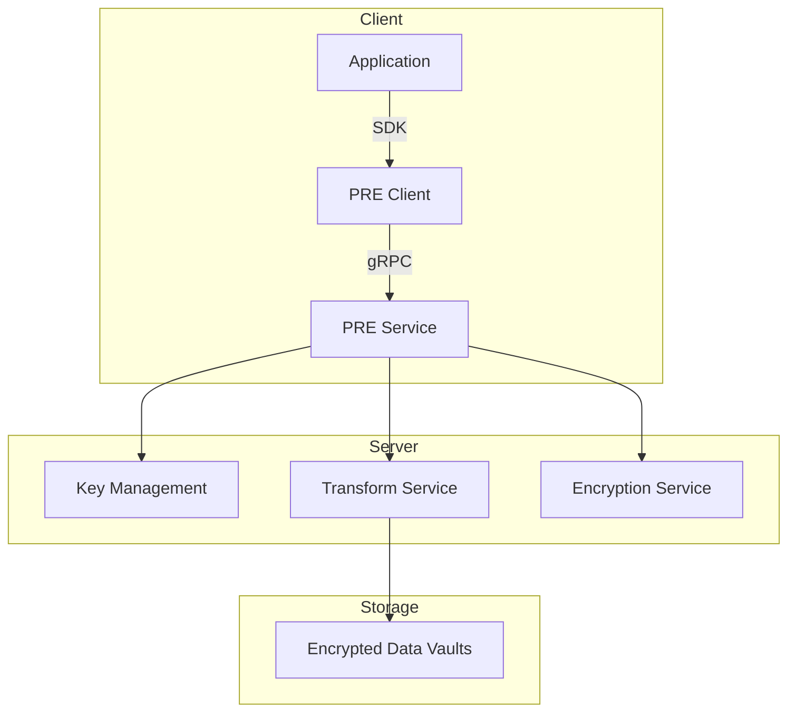

Gateway implements a state-of-the-art Proxy Re-encryption (PRE) system that enables secure data sharing without exposing the underlying content. Our implementation combines the efficiency of symmetric encryption with the flexibility of PRE through an enveloped encryption scheme.

## What is Proxy Re-encryption?

Proxy Re-encryption is a cryptographic primitive that allows a proxy to transform ciphertexts from one encryption key to another without accessing the underlying plaintext. This enables secure data sharing and delegated access control without compromising privacy.

## Technical Implementation

Our PRE system implements an enveloped encryption scheme:

1. **Data Layer**

   - Raw data is encrypted with AES-GCM-256
   - Uses a unique Data Encryption Key (DEK) for each encryption

2. **Key Layer**
   - DEK is encrypted using PRE
   - Based on pairing-based elliptic curve cryptography
   - 256-bit security level

The proxy re-encryption algorithm is based on several academic papers: ["A Fully Secure Unidirectional and Multi-user Proxy Re-encryption Scheme" by H. Wang and Z. Cao](https://www.sigsac.org/ccs/CCS2009/pd/abstract_16.pdf), and ["A Multi-User CCA-Secure Proxy Re-Encryption Scheme" by Y. Cai and X. Liu](https://ieeexplore.ieee.org/document/6945301). We're also leveraging the open-source implementation [recrypt-rs](https://github.com/IronCoreLabs/recrypt-rs) from IronCore Labs.

## Key Features

### 1. Unidirectional Transforms

- One-way delegation from sender to receiver
- No reverse transformation capability
- Maintains access control hierarchy

### 2. Multi-hop Capability

- Support for delegation chains
- Transforms can be applied sequentially
- Preserves security across hops

### 3. Security Properties

- Collusion resistance
- Non-interactive key generation
- Non-transitive delegations
- CCA2-secure in random oracle model

## Technical Foundation

The implementation is based on established academic research:

1. **Mathematical Basis**

   - Pairing-based cryptography
   - Barreto-Naehrig curves
   - Optimal Ate pairing implementation

2. **Security Model**
   - IND-Pr-CCA2 secure
   - Based on DBDH assumption
   - Forward and backward security

## Architecture

## Core Operations

1. **Key Generation**

   - Generate encryption keypairs
   - Derive transform keys
   - Manage key hierarchies

2. **Encryption**

   - Enveloped encryption process
   - DEK generation and encryption
   - Ciphertext production

3. **Transform**

   - Ciphertext transformation
   - Multi-hop processing
   - Access delegation

4. **Decryption**
   - Ciphertext validation
   - DEK recovery
   - Data decryption

## Why PRE?

Gateway chose PRE for several compelling reasons:

1. **Efficiency**

   - Minimal overhead for large files
   - Constant-size transforms
   - Fast encryption/decryption

2. **Security**

   - Strong mathematical foundations
   - Proven security properties
   - Robust access control

3. **Flexibility**
   - Support for complex sharing patterns
   - Easy integration with existing systems
   - Scalable architecture

## Next Steps

- Learn about our [performance benchmarks](./benchmarks)
- Explore [implementation examples](./examples)
- Set up with our [node documentation](./nodes)
- Review [security considerations](./security)
