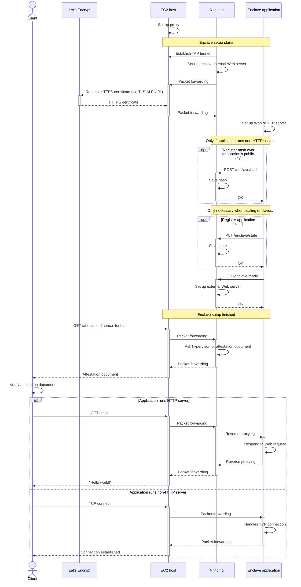

## Technical Architecture

### AWS Nitro Enclaves Implementation

The current implementation uses AWS Nitro Enclaves, which provide an isolated compute environment with its own kernel, memory, and CPU resources. The architecture follows a secure communication flow:

1. **Enclave Setup**:

   - EC2 host establishes a proxy and TAP tunnel
   - Nitriding (our security layer) sets up the enclave-internal web server
   - HTTPS certificates are automatically provisioned via Let's Encrypt
   - Application servers (Web/TCP) are initialized within the enclave

2. **Attestation Flow**:

   - Clients can request attestation documents with custom nonces
   - Attestation verification ensures enclave authenticity
   - Secure communication channels are established post-verification

3. **Runtime Security**:
   - Memory isolation from EC2 instance
   - Dedicated CPU resources
   - Cryptographic separation
   - Network isolation with controlled communication channels

