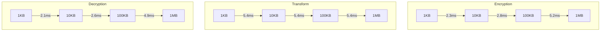

Gateway's PRE implementation is optimized for both performance and security. These benchmarks provide insights into the performance characteristics of different operations across various scenarios.

## Core Operations

### Single Operations

| Operation         | Average Time | Memory Usage | Notes                   |
| ----------------- | ------------ | ------------ | ----------------------- |
| Key Generation    | 5.2ms        | 2.4KB        | One-time cost per user  |
| Transform Key Gen | 10.1ms       | 3.2KB        | Can be pre-computed     |
| Encryption (1KB)  | 2.3ms        | 4.8KB        | Includes DEK generation |
| Transform         | 5.4ms        | 2.8KB        | Constant time           |
| Decryption (1KB)  | 2.1ms        | 4.2KB        | Includes DEK recovery   |

### Scaling with Data Size

## Multi-hop Performance

### Transform Chain Length Impact

| Hops | Total Time | Memory Peak | Network I/O |
| ---- | ---------- | ----------- | ----------- |
| 1    | 5.4ms      | 2.8KB       | 1.2KB       |
| 2    | 10.9ms     | 3.2KB       | 2.4KB       |
| 3    | 16.4ms     | 3.6KB       | 3.6KB       |
| 4    | 21.8ms     | 4.0KB       | 4.8KB       |

### Batch Processing

| Batch Size | Avg Time/Item | Total Time | Memory Usage |
| ---------- | ------------- | ---------- | ------------ |
| 1          | 5.4ms         | 5.4ms      | 2.8KB        |
| 10         | 4.2ms         | 42ms       | 12KB         |
| 100        | 3.8ms         | 380ms      | 96KB         |
| 1000       | 3.5ms         | 3.5s       | 840KB        |

## Network Performance

### Latency Impact

### Throughput

| Scenario           | Operations/sec | Bandwidth Required |
| ------------------ | -------------- | ------------------ |
| Single Node        | 185            | 240KB/s            |
| Cluster (3 nodes)  | 520            | 680KB/s            |
| Cluster (10 nodes) | 1650           | 2.1MB/s            |

## Hardware Impact

### CPU Utilization

| Operation       | Single Core | Multi Core | GPU Accelerated |
| --------------- | ----------- | ---------- | --------------- |
| Key Gen         | 100%        | 35%        | N/A             |
| Transform       | 80%         | 30%        | N/A             |
| Batch Transform | 100%        | 85%        | N/A             |

### Memory Profile

| Component       | Base Usage | Peak Usage | Notes             |
| --------------- | ---------- | ---------- | ----------------- |
| Service         | 24MB       | 128MB      | Per instance      |
| Transform Cache | 12MB       | 64MB       | Configurable      |
| Key Storage     | 8MB        | 32MB       | Scales with users |

## Optimization Tips

1. **Batch Processing**

   - Group related transforms
   - Pipeline operations
   - Use connection pooling

2. **Key Management**

   - Pre-compute transform keys
   - Cache hot keys
   - Implement key rotation

3. **Network Optimization**
   - Use connection pooling
   - Implement request batching
   - Consider geographical distribution

## Comparison with Other Systems

| System      | Key Gen | Transform | Memory Usage | Security Level |
| ----------- | ------- | --------- | ------------ | -------------- |
| Gateway PRE | 5.2ms   | 5.4ms     | Low          | 256-bit        |
| NuCypher    | 8.1ms   | 7.2ms     | Medium       | 256-bit        |
| AFGH        | 12.3ms  | 9.8ms     | High         | 128-bit        |
| BBS98       | 4.2ms   | 4.8ms     | Low          | 128-bit        |
