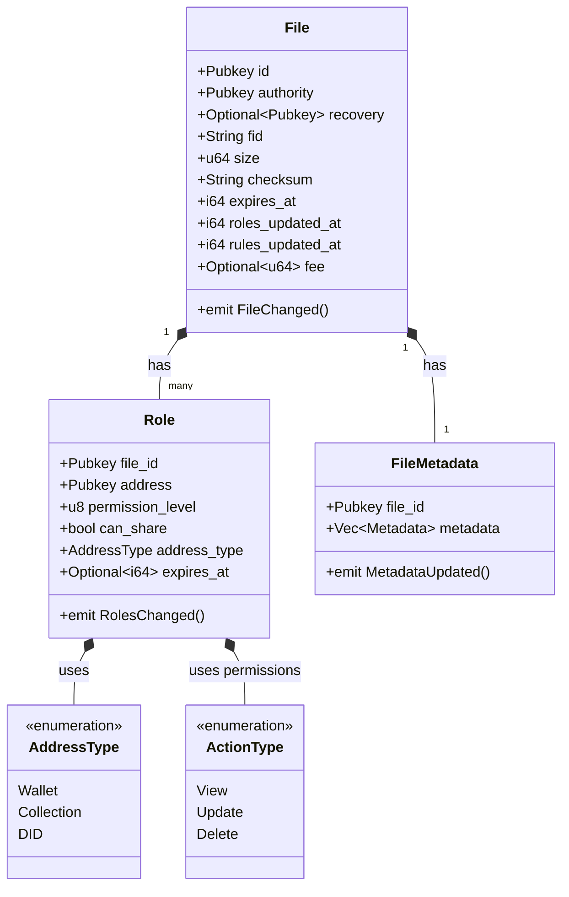

The coordination layer serves as the nervous system of Gateway's network, leveraging blockchain technology to maintain network state, manage access control, and store transaction proofs. While currently implemented on Solana for optimal cost and performance, Gateway's protocol remains blockchain-agnostic by design.

## System Architecture

Gateway strategically utilizes existing blockchain infrastructure to power up the Encrypted Data Vaults network. Solana currently serves as the anchor chain due to its high throughput and cost efficiency. The coordination layer anchors all critical network operations while maintaining flexibility for future blockchain integrations.

## Smart Contract Architecture

The coordination layer consists of three primary smart contracts that work together to maintain system state:

### File Registry Contract
The core contract maintains essential file information including identifiers, ownership, and integrity data. Each file record contains a unique identifier, authority address, size, and checksum. The system supports optional recovery addresses and expiration timestamps, enabling comprehensive lifecycle management.

### Role Management Contract
This contract implements Gateway's access control system through granular permission assignments. The permission structure supports three levels (View, Update, Delete) with additional sharing capabilities. Each role assignment can be time-limited through optional expiration timestamps and supports multiple address types including wallets, collections, and DIDs.

### Metadata Contract
Supporting arbitrary metadata storage through key-value pairs, this contract enables flexible data attribution while maintaining efficient querying capabilities. The system tracks all metadata changes through timestamped events, providing a complete audit trail of modifications.

## Event System

The coordination layer implements a comprehensive event system for state change notification:

1. FileChanged: Tracks modifications to core file attributes
2. RolesChanged: Records updates to access control assignments
3. MetadataUpdated: Captures changes to file metadata

These events enable efficient system monitoring and synchronization across the network.

## Network State Management

All network coordination data persists on-chain through smart contracts, providing a transparent and verifiable record of system state. This approach ensures:

1. Immutable record of all state changes
2. Verifiable access control decisions
3. Transparent file management operations
4. Auditable metadata modifications

## Integration Considerations

When interacting with the coordination layer, applications should implement proper transaction verification and error handling. The system requires careful management of gas costs and transaction limits while maintaining proper sequence of operations for state changes.

<Info>If you're still exploring Encrypted Data Vaults to understand if they are right for you, please use the API experience.</Info>