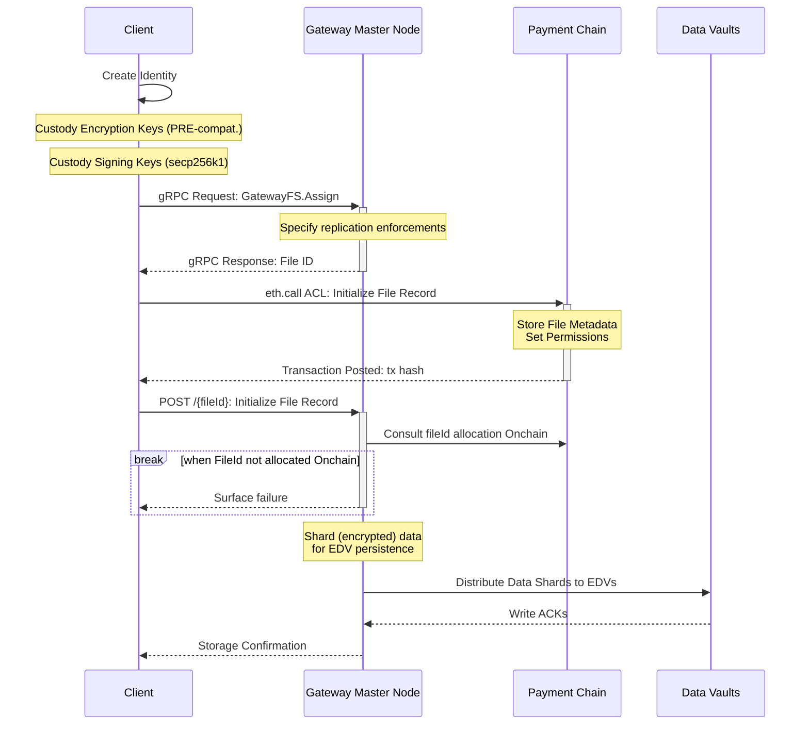

This guide describes the process of integrating with Gateway's Storage Layer directly, from initial setup to storage confirmation.

<Info>Check out the [Developer API](/developer-guide/api-reference/introduction) instead for commonly-used operations.</Info>

## Integration Flow



## 1. Identity Creation

### Encryption Keys
Generate a PRE-compatible key pair for encryption operations. For detailed instructions on key generation, see [PRE Key Documentation](/compute/pre/api#1-generate-key-pair).

### Signing Keys
Generate secp256k1 signing keys for transaction authentication

```typescript
import { Wallet } from 'ethers';

// Generate a new random wallet
const wallet = Wallet.createRandom();

// Get the private key (keep this secret!)
const privateKey = wallet.privateKey;
// Get the public key
const publicKey = wallet.publicKey;
// Get the Ethereum address
const address = wallet.address;

console.log('Private Key:', privateKey);
console.log('Public Key:', publicKey);
console.log('Address:', address);
```


## 2. File Assignment

Request a File ID from the Gateway Master Node using gRPC.

<Warning>
  **You must obtain an mTLS certificate** from the Gateway team to network with our Storage Layer.

  See [Authentication Requirements](/storage/operators/requirements#authentication-requirements) to generate your certificate.
</Warning>

```typescript
const path = require('path');
const fs = require('fs');
const grpc = require('@grpc/grpc-js');
const protoLoader = require('@grpc/proto-loader');

// Load certificates
const rootCert = fs.readFileSync(path.join(__dirname, 'certs/ca.crt'));
const clientKey = fs.readFileSync(path.join(__dirname, 'certs/node.key'));
const clientCert = fs.readFileSync(path.join(__dirname, 'certs/node.crt'));

// Create SSL credentials with mTLS
const sslCreds = grpc.credentials.createSsl(
  rootCert,
  clientKey,
  clientCert
);

// Load proto file
const packageDefinition = protoLoader.loadSync(
  path.join(__dirname, 'master.proto'),
  {
    keepCase: true,
    longs: String,
    enums: String,
    defaults: true,
    oneofs: true
  }
);

const protoDescriptor = grpc.loadPackageDefinition(packageDefinition);
const master = protoDescriptor.master;

// Create client instance
const stage: 'testnet' | 'mainnet' = "testnet";
const client = new master.GatewayFS(
  `master.${stage}.gateway.tech:19333`,
  sslCreds
);

// Make Assign RPC call
client.assign(
  {
    count: 1,
    replication: '000',
    collection: 'default'
  },
  (error, response) => {
    if (error) {
      console.error('Error:', error);
      return;
    }
    console.log('Assign Response:', response);
  }
);
```

## 3. Chain Registration

Initialize the file record on the payment chain to establish ownership and permissions:

<Info>
Contract information coming soon.
</Info>

## 4. File Upload

Upload your file to the Gateway network using the assigned File ID:

```typescript
import { ethers } from 'ethers';
import { readFileSync } from 'fs';

const stage: "testnet" | "mainnet" = "testnet";
const fileId: string = ""; // todo: update with allocated fileId
const privateKey: string = ""; // todo: signer's private key

// Sign the fileId directly
const wallet = new ethers.Wallet(privateKey);
const signature = await wallet.signMessage(fileId);

// Load file data
const fileData = readFileSync('path/to/your/file.txt');

const formdata = new FormData();
formdata.append("data", new Blob([fileData]));
formdata.append("signature", signature);

const requestOptions = {
  method: "POST",
  body: formdata,
  redirect: "follow"
};

fetch(`https://master.${stage}.gateway.tech:9333/${fileId}`, requestOptions)
  .then((response) => response.text())
  .then((result) => console.log(result))
  .catch((error) => console.error(error));
```

## Best Practices

1. Implement retry logic for API calls
2. Verify transaction confirmations
3. Validate file integrity
4. Monitor storage quotas
5. Handle API rate limits

## Security Considerations

1. Secure API key management
2. Client-side encryption before upload
3. Checksum verification
4. Transaction signature verification
5. Regular permission audits

## Error Handling

Common integration points requiring error handling:

1. API Errors
   - Network connectivity issues
   - Authentication failures
   - Rate limiting
   - Invalid requests

2. Chain Transaction Errors
   - Transaction failures
   - Invalid parameters
   - Insufficient funds
   - Permission errors