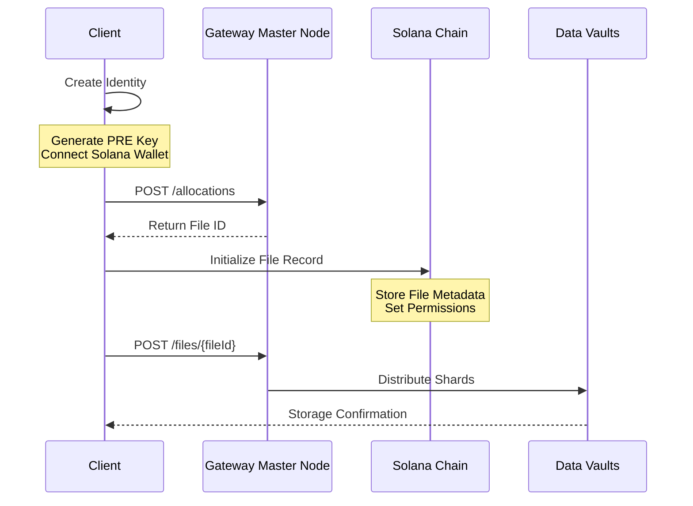

<Warning>This is for advanced users only. For 99% of people trying to use Encrypted Data Vaults, the best option is to use our API and SDKs!</Warning>

This guide describes the process of integrating with Gateway's Encrypted Data Vault (EDV) system, from initial setup through file storage.

## Integration Flow



## Step 1: Identity Setup

### Solana Wallet
Set up a Solana-compatible wallet for contract interactions.

### PRE-Compatible Key
Generate a PRE-compatible key pair for encryption operations. For detailed instructions on key generation, see: [PRE Key Documentation](/compute/marketplace/pre/api).

## Step 2: Solana Client Setup

Configure a Solana client to interact with Gateway's smart contracts:

```typescript
import { Connection, PublicKey } from '@solana/web3.js';
import { Program, AnchorProvider } from '@project-serum/anchor';
import { IDL } from './gateway_idl';

// Gateway Program ID
const PROGRAM_ID = new PublicKey('C6XuRN6Go3ruag1dc7c8BASzTUYfTxmyBw1a5DdKypYC');

// Initialize connection and provider
const connection = new Connection('https://api.mainnet-beta.solana.com');
const provider = new AnchorProvider(connection, wallet, {});

// Initialize program interface
const program = new Program(IDL, PROGRAM_ID, provider);
```

## Step 3: Storage Allocation

Request storage allocation from the Gateway master node:

```typescript
// TODO: change
// REST endpoint for allocation
const response = await fetch('https://api.gateway.network/allocations', {
    method: 'POST',
    headers: {
        'Content-Type': 'application/json',
        'Authorization': 'Bearer <YOUR_API_KEY>'
    },
    body: JSON.stringify({
        size: fileSize,
        retention: retentionPeriod
    })
});

const { fid } = await response.json();
```

## Step 4: Chain Registration

Initialize the file record on Solana using the File ID (fid) received from the master node:

```typescript
const fileData = {
    fid: fid,                    // From master node
    size: fileSize,
    checksum: fileHash,          // SHA-256 of encrypted file
    expires_at: expirationTime
};

await program.methods.initializeFiles(fileData)
    .accounts({
        contributor: wallet.publicKey,
        // Additional accounts as required by the contract
    })
    .rpc();
```

## Step 5: File Upload

Upload the encrypted file to the Gateway network:

```typescript
const formData = new FormData();
formData.append('file', encryptedFile);

const uploadResponse = await fetch(`https://api.gateway.network/files/${fid}`, {
    method: 'POST',
    headers: {
        'Authorization': 'Bearer <YOUR_API_KEY>'
    },
    body: formData
});
```

## Best Practices

1. Implement retry logic for API calls
2. Verify transaction confirmations
3. Validate file integrity
4. Monitor storage quotas
5. Handle API rate limits

## Security Considerations

1. Secure API key management
2. Client-side encryption before upload
3. Checksum verification
4. Transaction signature verification
5. Regular permission audits

## Error Handling

Common integration points requiring error handling:

1. API Errors
   - Network connectivity issues
   - Authentication failures
   - Rate limiting
   - Invalid requests

2. Chain Transaction Errors
   - Transaction failures
   - Invalid parameters
   - Insufficient funds
   - Permission errors