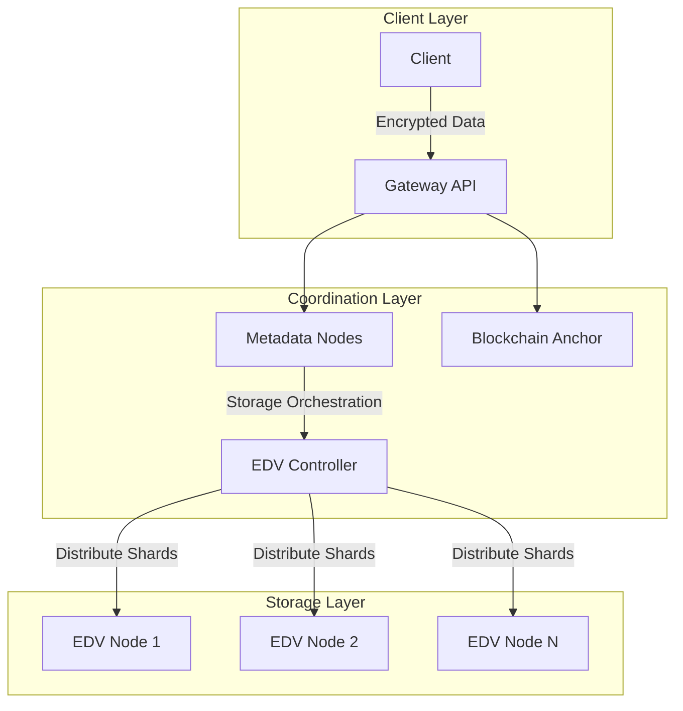

Gateway Protocol's storage layer implements a distributed, privacy-preserving infrastructure that ensures data security and availability while minimizing storage overhead. The system combines erasure coding, zero-knowledge proofs, and proxy re-encryption to create a secure and efficient storage network.

## System Architecture

The Gateway storage architecture operates across three distinct layers that work in concert to provide secure and efficient data storage services.

The Client Layer manages all user-facing operations. It handles initial data encryption, user authentication, and provides the primary interface through the Gateway API. All cryptographic operations necessary for ensuring end-to-end security occur at this layer before data transmission.

The Coordination Layer serves as the network's central nervous system. Through metadata management and blockchain anchoring, it orchestrates storage operations and maintains the network's state. This layer validates storage proofs and coordinates data sharing operations while ensuring all access controls are properly enforced.

The Storage Layer consists of distributed Encrypted Data Vaults (EDVs) that form the backbone of the storage infrastructure. These nodes work together to store encrypted data shards, execute proxy re-encryption operations, and maintain proofs of storage.

## Core Components

### Encrypted Data Vaults (EDVs)

EDVs serve as the fundamental storage units within Gateway's infrastructure. Each vault operates as an isolated environment for encrypted data shards, capable of executing proxy re-encryption operations for secure data sharing. Through continuous proof generation and maintenance, EDVs ensure data integrity while participating in recovery operations when needed.

### Erasure Coding System

Gateway's implementation of Reed-Solomon erasure coding represents a significant advancement in distributed storage efficiency. The system employs a 10:4 parity ratio, creating 14 total shards for each stored file. This carefully chosen ratio provides optimal balance between redundancy and storage efficiency.

#### Distribution Strategy

The erasure coding process first divides incoming data into 10 equal chunks. The system then generates 4 parity shards using Reed-Solomon algorithms. These 14 resultant shards are distributed across geographically diverse EDV nodes based on factors including:

- Network latency and bandwidth capacity
- Current storage utilization
- Geographic distribution for regulatory compliance
- Historical node reliability metrics

#### Recovery Process

During file recovery, the system only needs any 10 shards from the total 14 to reconstruct the original file. This approach provides significant advantages over traditional replication:

- Faster recovery times through parallel shard retrieval
- Lower network bandwidth requirements
- Improved resistance to geographic network outages
- Reduced storage costs while maintaining reliability

### Proxy Re-encryption (PRE)

<Note>You can learn more about our implementation of PRE here: [Overview](/compute/marketplace/pre/overview).</Note>

The PRE system employs a non-interactive key generation protocol. When a data owner initiates sharing, the system generates re-encryption keys without requiring direct communication between parties. This process preserves the confidentiality of both the owner's and recipient's private keys.

#### Transform Key Security

Re-encryption keys are generated with carefully controlled scope. Each key:

- Can only re-encrypt specific data shards
- Has configurable time-based validity
- Cannot be used to decrypt the original data
- Cannot be combined with other keys to escalate privileges

#### Shard-Level Operations

Re-encryption occurs independently at each EDV storing relevant shards. This distributed approach provides several advantages:

- No single point of system compromise
- Parallel processing reduces latency
- Network bandwidth optimization

The combination of erasure coding and PRE creates unique security properties. Even if an attacker compromises multiple EDV nodes, they cannot:

- Reconstruct the original file without sufficient shards
- Access plaintext data without appropriate decryption keys
- Generate valid re-encryption keys without proper authorization
- Bypass the access control system through direct shard access

### Proof of Storage

The proof of storage system utilizes ZK-SNARKs to verify data integrity without exposing the underlying information. Each EDV maintains chunk hashes and constructs merkle trees to guarantee data hasn't been tampered with. The system batches proofs for efficient verification and anchors these commitments to the blockchain for immutable record-keeping.

## Data Flows

Data flows through the system follow two primary patterns: storage and retrieval.

During storage, clients first encrypt their data locally. The system then applies erasure coding to generate shards, which EDVs store securely. Nodes generate storage proofs, while the coordination layer anchors commitments and metadata nodes record shard locations.

For retrieval, the process begins with client authentication and access verification. The coordination layer locates the necessary shards, which EDVs then provide for reconstruction. Finally, the client performs decryption to access the original data.

## Security Architecture

Gateway's security architecture rests on three pillars: data privacy, high availability, and access control.

Data privacy is ensured through end-to-end encryption, zero-knowledge storage proofs, and secure proxy re-encryption. The system maintains confidentiality at every step, from initial storage through sharing and retrieval.

High availability comes from the distributed nature of shard storage combined with erasure coding redundancy. The system can automatically recover from node failures and maintains geographic distribution to ensure resilience.

Access control is enforced cryptographically, with granular permissions managed through secure sharing via PRE. All access patterns are auditable, and the system supports time-based access policies.

## Network Coordination

The coordination layer leverages blockchain technology to store proof commitments and record access control conditions. By anchoring these records on Solana, Gateway ensures transparent verification while maintaining cross-chain compatibility.

Metadata management occurs through a dedicated subsystem that tracks shard locations, manages access policies, and coordinates recovery operations. This system orchestrates data sharing and maintains comprehensive proof records.

## Best Practices

For optimal system operation, operators should focus on regular proof validation and monitoring of shard distribution. Geographic redundancy and performance optimization should guide resource allocation decisions.

Security considerations must include robust key management procedures and carefully designed access policies. Regular audit logging and compliance checks ensure the system maintains its security guarantees.

Performance optimization relies on smart shard distribution strategies and efficient proof batching. The network topology should be designed to minimize latency while maintaining proper load balancing across nodes.

## Integration Guidelines

Gateway's storage system integrates seamlessly with computation features, enabling secure data access for processing within our PET Marketplace. The system supports privacy-preserving processing while maintaining efficient data handling and secure result storage.

The platform offers broad cross-platform support through multi-chain compatibility and comprehensive API integration. Standard compliance and protocol interoperability ensure smooth integration with existing systems.
